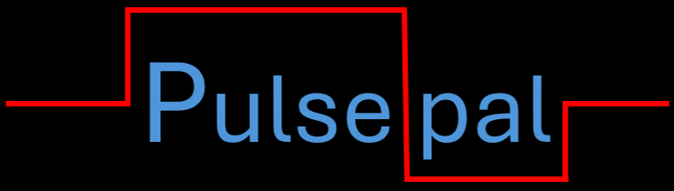

# 

**An agent with intelligent decision-making for Pulseq MRI sequence development**

[](https://www.python.org/downloads/)
[](https://ai.pydantic.dev/)
[](https://chainlit.io/)
[](https://ai.google.dev/)
[](https://opensource.org/licenses/MIT)

## 🚀 What is PulsePal?

PulsePal is an intelligent AI assistant specifically designed for MRI sequence programming using the Pulseq framework. PulsePal combines deep MRI physics knowledge with Pulseq-specific documentation.

### Why use Pulsepal?

Incredibly powerful coding assistant LLMs currently exist, but try using any for Pulseq and you might find yourself frustrated. Pulseq has unique function signatures and sequence design pipeline that is applied to the ever-changing and specialized MRI pulse sequence design field. Additionally, Pulseq is a two-sided coin, with programming on one side and MRI knowledge on the other, requiring knowledge of subtle but vital connections between MRI principles and sequence design. For this reason, LLMs will often be over-confident with their written Pulseq code and hallucinate.

## 1. **Specialized Pulseq Knowledge Base**
- **Comprehensive Documentation Access**: PulsePal has access to a curated Supabase database with:
  - Documentation chunks from official Pulseq sources
  - API function references (MATLAB, Python, C++)
  - Categorized official sequence examples
  - Scraped Pulseq tutorials and community implementations
- General LLMs lack this specialized, up-to-date Pulseq documentation

## 2. **Pulseq-Specific Function Intelligence**
- **Function Clustering Knowledge**: Understands which Pulseq functions work together
- **Missing Function Detection**: Automatically identifies potentially missing functions in user code based on usage patterns
- **Namespace Validation**: Knows the difference between Pulseq namespaces (example: `mr.*` and `seq.*` )
- General LLMs often confuse these Pulseq-specific patterns

## 3. **Physics-First Debugging Approach**
- **Systematic Analysis Framework**: Traces from MRI physics problems to specific Pulseq code implementations
- **Novel Problem Handling**: Can reason through problems never seen before using physics principles
- **Educational Explanations**: Responses tie Pulseq together with MRI physics concepts, not just providing code
- General LLMs may approach Pulseq code as a programmer, instead of an MRI + programmer hybrid

## 4. **Validated Syntax and Parameters**
- **Function Validation**: Checks against actual Pulseq function signatures and parameters
- **Common Error Detection**: Identifies typical mistakes like `mr.write()` instead of `seq.write()`
- **Parameter Requirements**: Knows which parameters are required vs. optional
- General LLMs may suggest non-existent functions or wrong parameter combinations

## 5. **Educational Value**
- **Physics Context**: Freely provides MRI physics explanations alongside code - great for beginners to pulse sequence design!
- **Learning-Oriented**: Designed to teach users, not just solve problems
- **Progressive Complexity**: Can adapt explanations from beginner to expert level
- General LLMs may provide code without educational context

## Example Comparison:

**Generic LLM Response:**
```matlab
% May suggest incorrect function
gx = mr.createTrap('x', amplitude, duration)  % This function doesn't exist!
```

**PulsePal Response:**
```matlab
% Correct Pulseq function with proper parameters
gx = mr.makeTrapezoid('x',lims,'Amplitude',amplitude,'FlatTime',flatTime);
```

PulsePal essentially serves as an MRI physics expert with comprehensive Pulseq documentation at its fingertips, providing accurate, educational, and contextually appropriate assistance that general LLMs simply cannot match for this specialized domain.

## 🧠 How PulsePal Works

PulsePal uses intelligent decision-making to provide optimal responses:

### Built-in Knowledge
- **MRI Physics**
- **General Programming**: MATLAB/Python syntax, best practices
- **Sequence Concepts**: Spin echo, gradient echo, EPI, diffusion sequences, etc.

### Strategic Documentation Access
- **Pulseq Functions**: Specific function parameters and usage
- **Implementation Examples**: Working code from official documentation
- **Advanced Features**: Complex sequence implementations

## 🏗️ Architecture

PulsePal is built with modern Python async patterns:

- **Single Agent Design**: One intelligent agent handles all queries
- **PydanticAI Framework**: Type-safe agent development with proper error handling
- **Currently: Google Gemini 2.5 Flash**: Advanced reasoning capabilities
- **Currently: Supabase Vector DB**: Hybrid search for Pulseq documentation
- **Semantic Query Routing**: Automatic determination of documentation needs

## How should I use Pulsepal?

Think of Pulsepal as a coworker or researcher who has extensive Pulseq and MRI knowledge. Here are some example questions:
- What is T1 relaxation? What part of the code considers this?
- Can you help me plot this in k-space?
- I keep getting this error- what is it?
- I am new to Pulseq. Can you provide me a demo script and walk me through it step-by-step?
- I am currently working on creating a diffusion-EPI sequence. Can you provide me a Pulseq template of how this should be implemented?
- I ran my sequence on the scanner and my images were very dark. Can you help me debug my code?
- Are there any examples of EPI in pulseq?
- What are the parameters of seq.makeArbitraryGrad and how do I use it? --> **By the way, Pulsepal will correct you and tell you its 'mr.makeArbitraryGrad'! ;)**

**How NOT to use Pulsepal**
- Create a PROPELLER sequence that I can run on a GE system.

Believe it or not, MRI pulse sequence design is hard! This applies to LLM's as well. They perform great when you provide specific details and work incrementally.

## 🤝 Contributing

While most of the source code is available on GitHub for anybody interested, please reach out to rmoskwa@wisc.edu for ways you can contribute.

## 📄 License

This project is licensed under the MIT License - see the [LICENSE](LICENSE) file for details.
