# PulsePal Architecture Diagrams

## System Architecture

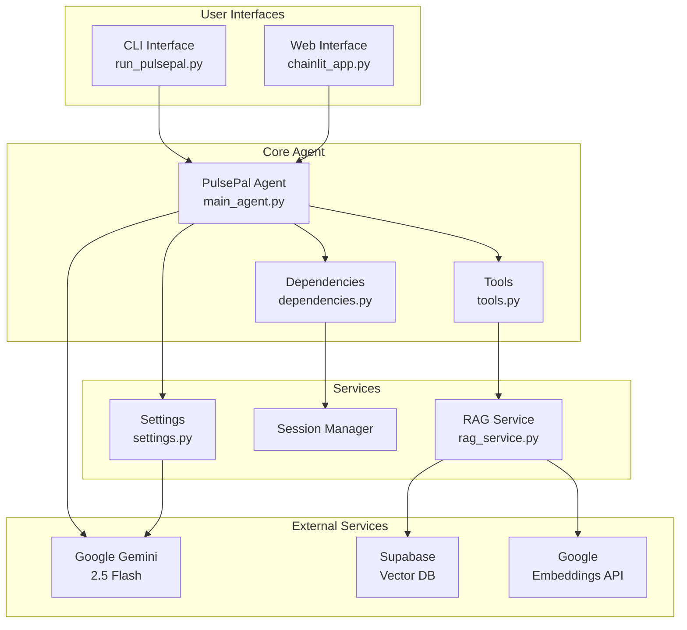

## Data Flow Diagram

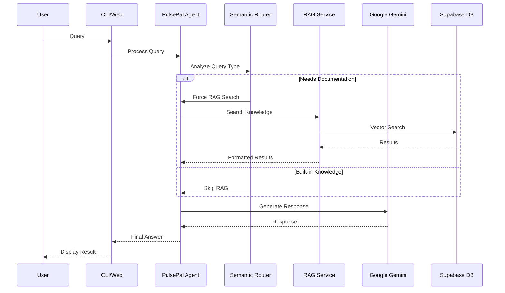

## Module Relationships

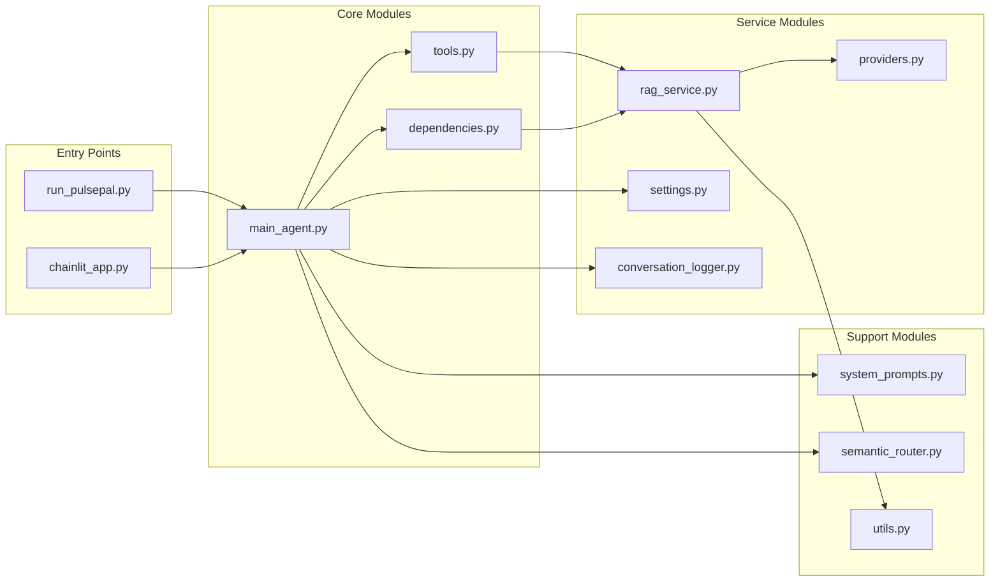

## Session Management Flow

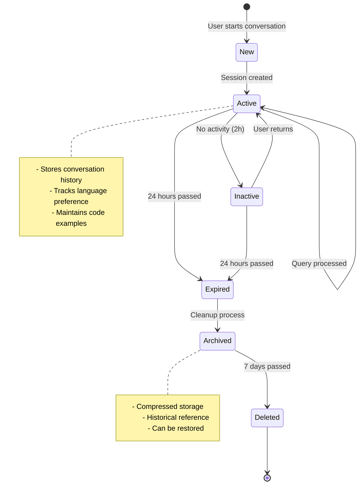

## RAG Service Architecture

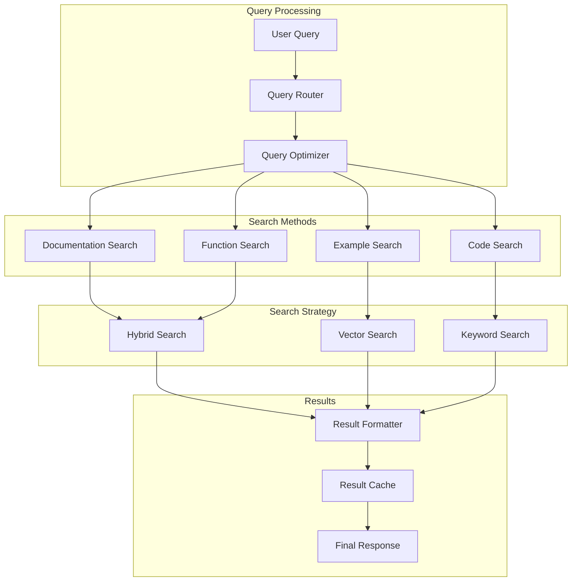

## Decision Flow - Built-in vs RAG Search

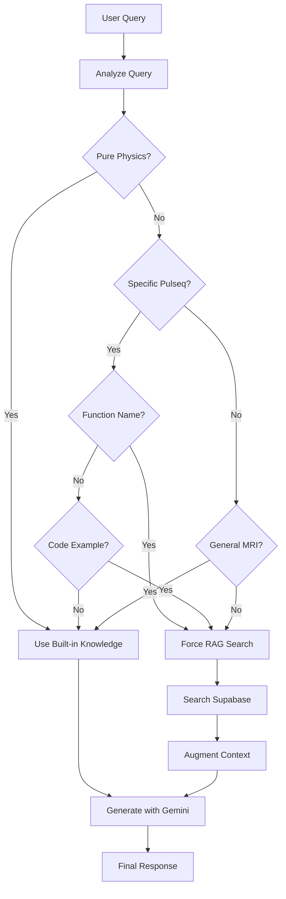

## Component Interaction Diagram

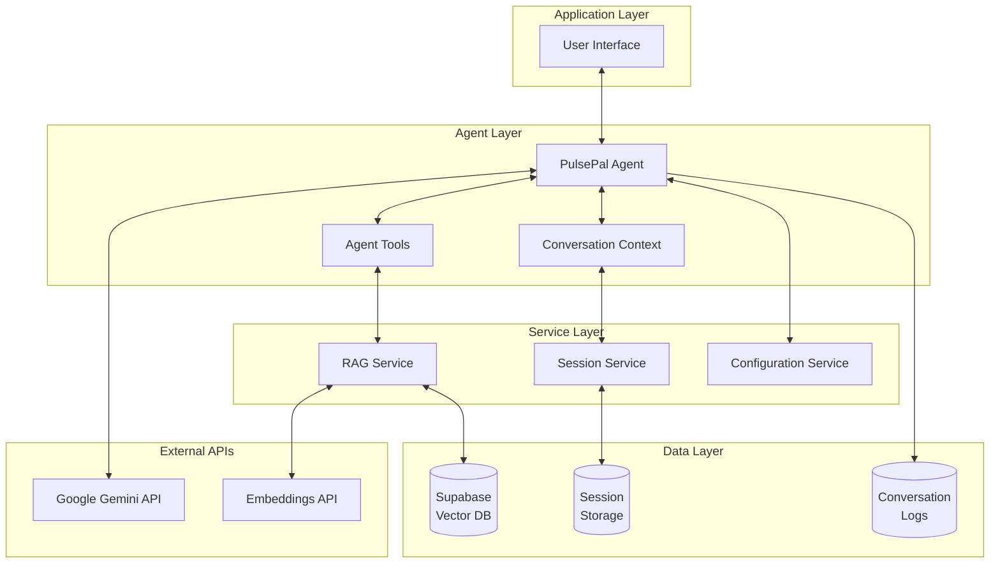

## Deployment Architecture

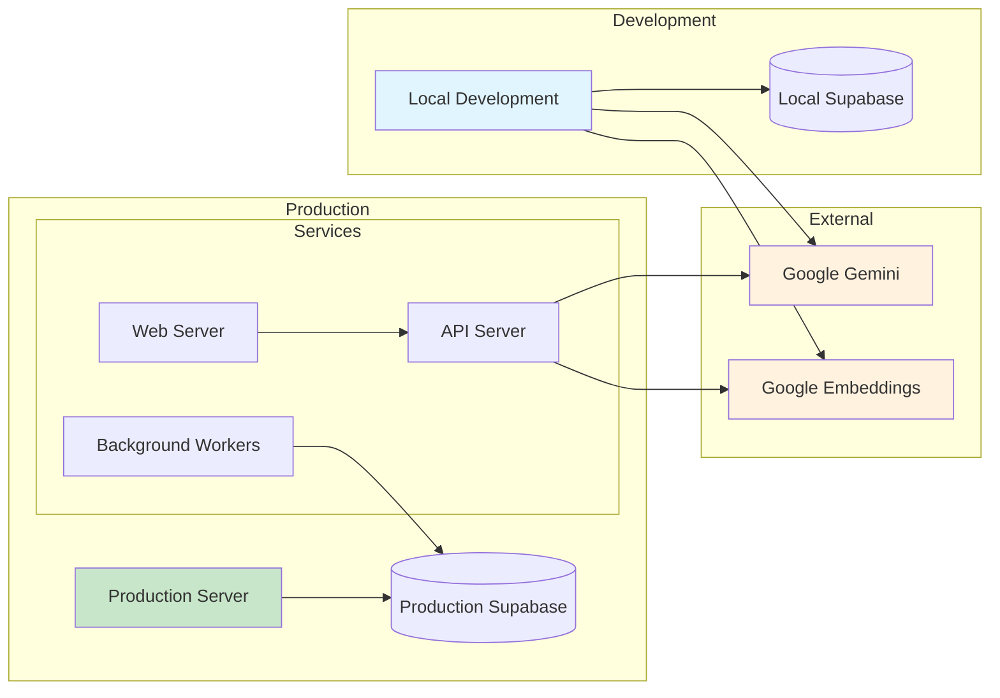

## Error Handling Flow

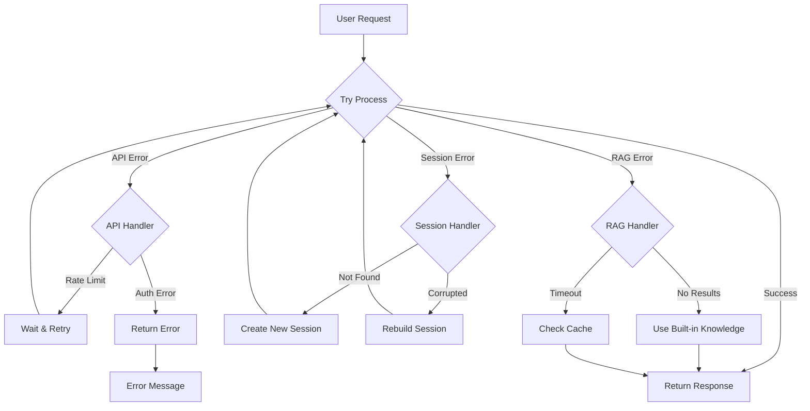

## Performance Optimization Strategy

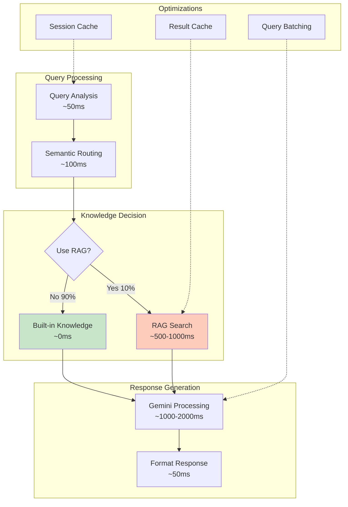

## Testing Coverage Map

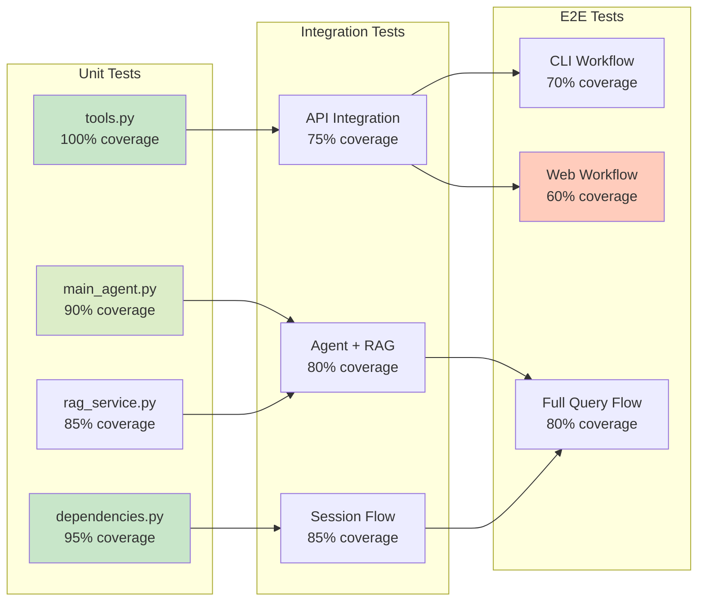

---

These diagrams use Mermaid syntax and can be rendered in:
- GitHub markdown files
- VS Code with Mermaid extension
- Online at mermaid.live
- MkDocs documentation

To update diagrams, edit the Mermaid code blocks above.
